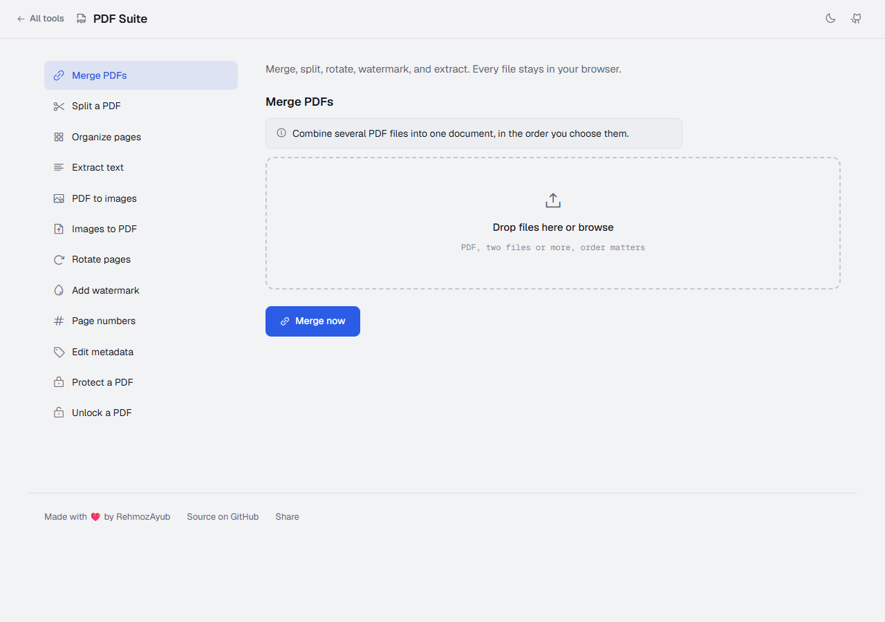
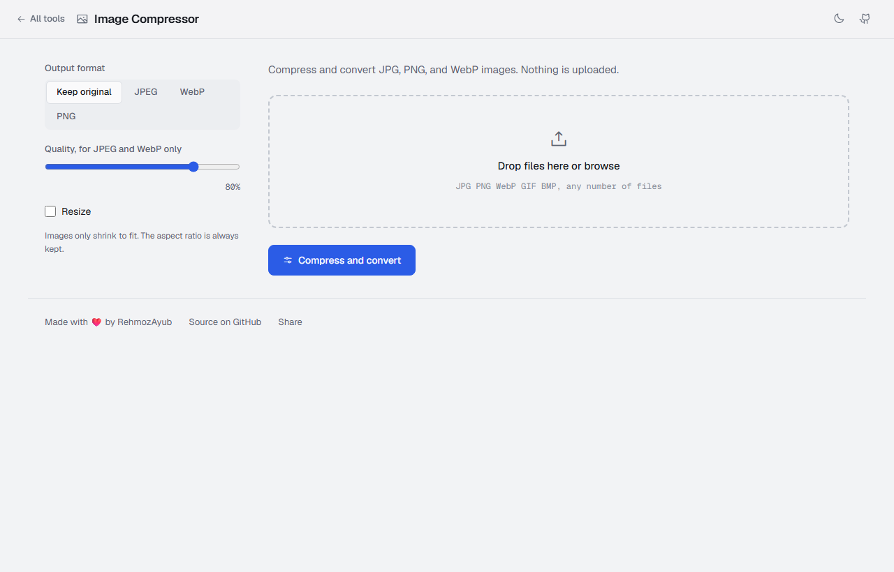
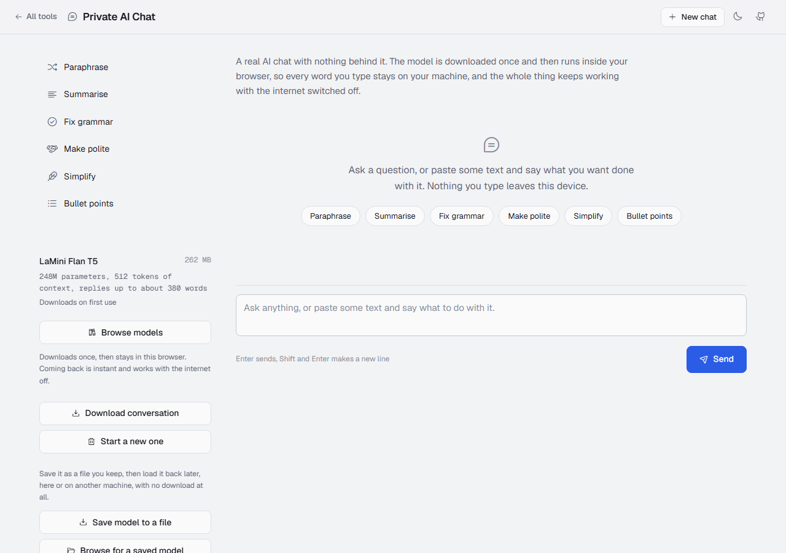
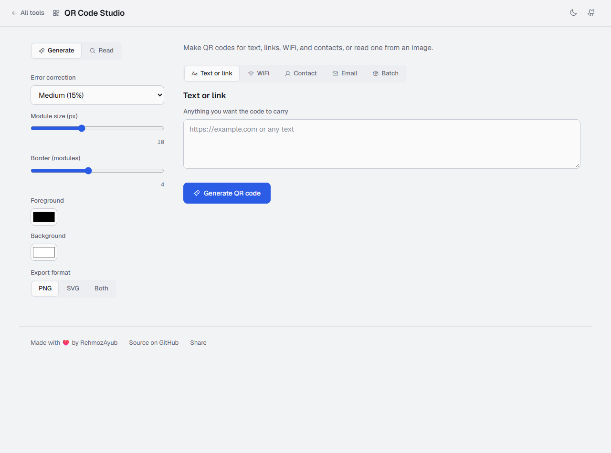
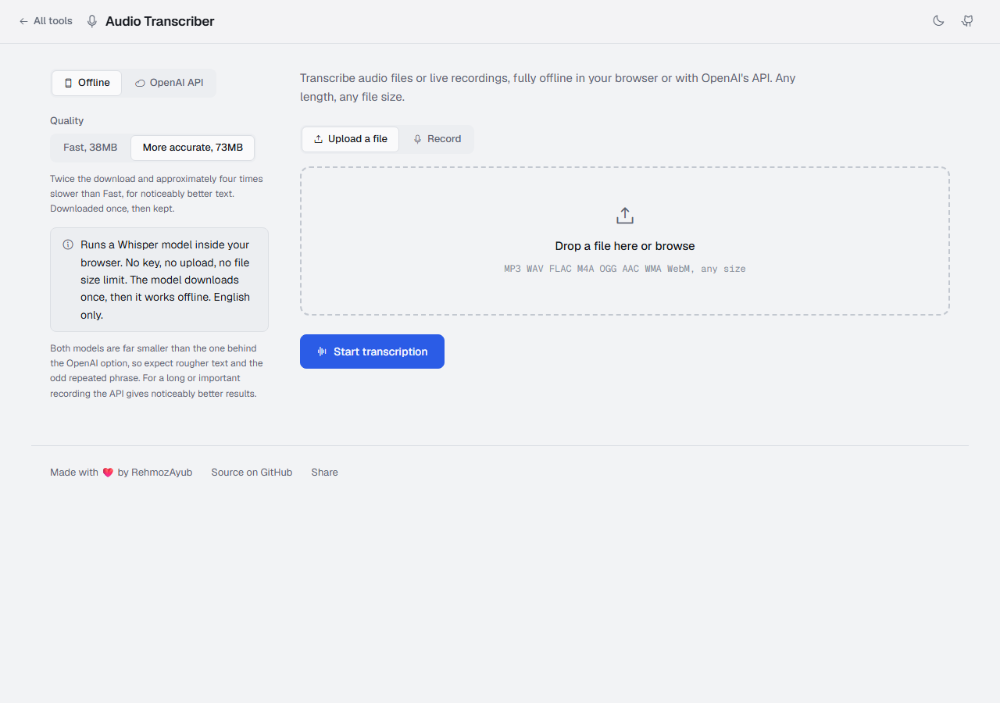
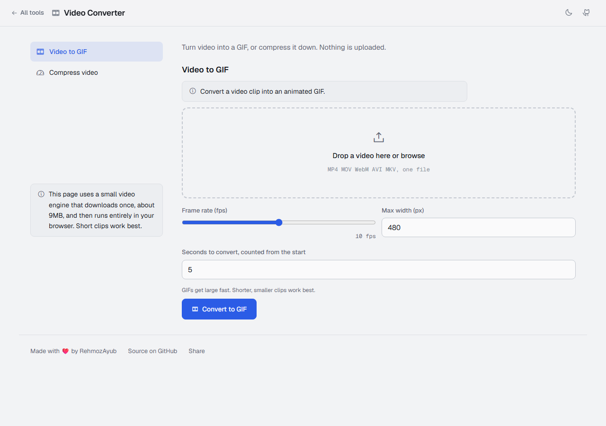
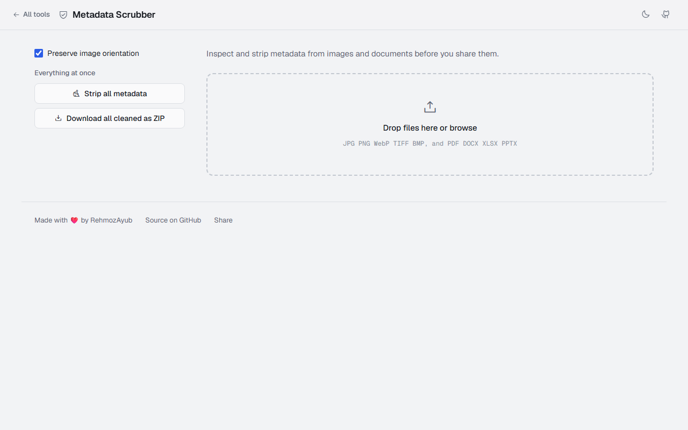
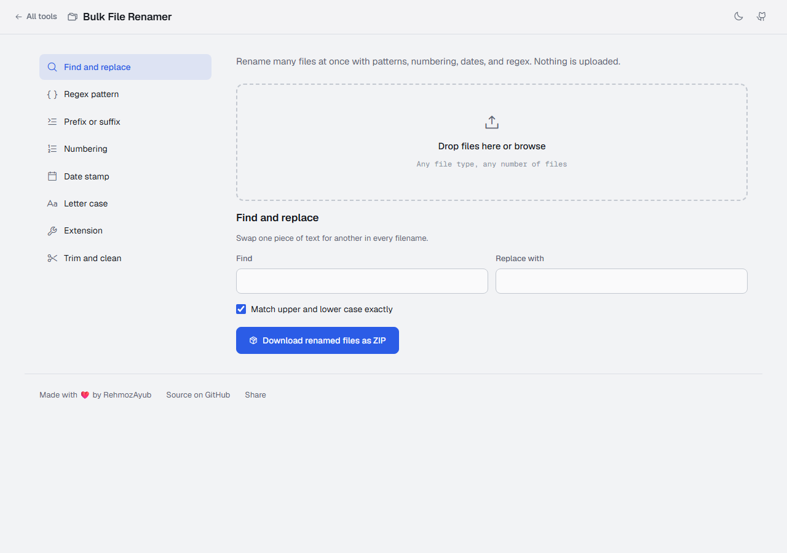
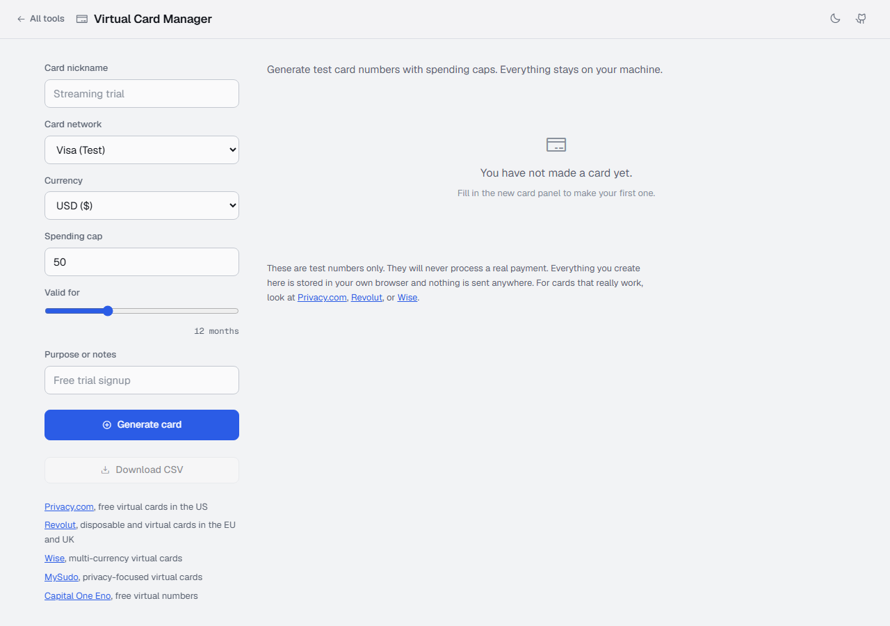

# tools-for-everyone

Some tools I made to make life easier.

All of these tools are completely free for you to use and run for your own benefit.
I believe technology should be shared for good and productive purposes, so everyone can benefit.

**Live site, no install needed: [rehmozayub.github.io/tools-for-everyone](https://rehmozayub.github.io/tools-for-everyone/)**

Every tool runs entirely in your browser. Nothing you open here is ever uploaded to a server, mine or anyone else's.

You can also install the site as an app. Open the live site and use the **Install app** button in the header (Chrome, Edge, and Android). On iPhone, use Share then **Add to Home Screen**. It then opens in its own window and keeps working offline.

Most tools come in **two versions**:
- **HTML (browser)** - what the live site above runs. Also works completely offline: double-click the `.html` file in any tool folder and it runs instantly, no setup needed.
- **Streamlit (Python)** - a fuller desktop app for the original six tools, for anyone who prefers a local Python environment. Some of these require a `.env` file for configuration, which you can create yourself from each tool's own README.

If you have any questions, need help, or want to share your experience, feel free to reach out to me.
Instagram: @rehmozdoesstuff
LinkedIn: https://www.linkedin.com/in/rehmozayub/

---

## Available Tools

### PDF Suite
Merge, split, organize pages, compress, extract text, convert to and from images, rotate, watermark, add page numbers, edit metadata, password-protect, and unlock PDFs.
[Open in browser](https://rehmozayub.github.io/tools-for-everyone/PDF%20Suite/pdf_suite.html) · [Streamlit version](PDF%20Suite/)

### Image Compressor
Compress and convert JPG, PNG, and WebP images, with resize controls and before/after file size comparison. Batch processing with a one-click ZIP download.
[Open in browser](https://rehmozayub.github.io/tools-for-everyone/Image%20Compressor/image_compressor.html) · browser only, built with plain Canvas

### Private AI Chat
Chat with an AI model that runs entirely inside your browser: ask it things, paraphrase, summarise, fix grammar, make a blunt message polite, simplify jargon, or turn a paragraph into bullet points. Replies stream in as they are written, and you can stop one part way. Browse a library of models from 260MB up to 2.3GB, each listed with its parameters, context, and how long a reply it can write, and pick the one that suits your machine. Every model on that list has been run and read before it was put there, and you can search Hugging Face from the same window for any of the thousands of others that run in a browser, choosing which build of each to download. A model downloads once and is kept on your device, and you can save it to a file and load it back later so it runs with no download at all, or remove it again when you are done with it.
[Open in browser](https://rehmozayub.github.io/tools-for-everyone/Private%20AI%20Chat/private_ai_chat.html) · browser only, built with [transformers.js](https://github.com/huggingface/transformers.js)

### QR Code Studio
Generate and decode QR codes: text, URLs, WiFi networks, vCard contacts, emails, and batch mode. Customizable colors, error correction, and border. Export as PNG or SVG. Decode from an uploaded image with auto-parsing of WiFi/vCard/URL payloads.
[Open in browser](https://rehmozayub.github.io/tools-for-everyone/QR%20Code%20Studio/qr_code_studio.html) · [Streamlit version](QR%20Code%20Studio/)

### Audio Transcriber
Transcribe audio files or live recordings two ways: fully offline with a small Whisper model that runs in your browser and needs no key at all (the default), or with OpenAI's Whisper API using a key you provide. There is no file size or length limit either way: long recordings are decoded once and transcribed in parts, with the transcript building up as it goes.
[Open in browser](https://rehmozayub.github.io/tools-for-everyone/Audio%20Transcriber/audio_transcriber.html) · [Streamlit version](Audio%20Transcriber/)

### Video Converter
Turn a video clip into a GIF, or compress a video down to a smaller MP4. Runs on a small WebAssembly build of ffmpeg that downloads once (about 9MB) and works fully offline after that.
[Open in browser](https://rehmozayub.github.io/tools-for-everyone/Video%20Converter/video_converter.html) · browser only, built with [ffmpeg.wasm](https://github.com/ffmpegwasm/ffmpeg.wasm)

### Metadata Scrubber
Inspect and strip metadata from images (JPG, PNG, WebP, TIFF, BMP) and documents (DOCX, PDF, XLSX, PPTX), including GPS location. Per-file privacy risk alerts, strip individually or batch-download all cleaned files as a ZIP.
[Open in browser](https://rehmozayub.github.io/tools-for-everyone/Metadata%20Scrubber/metadata_scrubber.html) · [Streamlit version](Metadata%20Scrubber/)

### Bulk File Renamer
Rename many files at once with find and replace, regex patterns, prefix/suffix, sequential numbering, date stamps, case conversion, and extension control. Live preview with duplicate detection, download as a ZIP.
[Open in browser](https://rehmozayub.github.io/tools-for-everyone/Bulk%20File%20Renamer/bulk_rename.html) · [Streamlit version](Bulk%20File%20Renamer/)

### Virtual Card Manager
Generate Luhn-valid test card numbers with spending caps and expiry dates, so you never hand real banking details to a site you don't trust yet. Freeze/unfreeze, spending progress bar, CSV export, and links to real virtual-card providers. Zero network calls, everything stays on your machine.
[Open in browser](https://rehmozayub.github.io/tools-for-everyone/Virtual%20Card%20Manager/virtual_card_manager.html) · [Streamlit version](Virtual%20Card%20Manager/)

---

## Privacy

Every tool above processes your files locally, in your own browser. The one exception is Audio Transcriber's OpenAI mode, which sends audio directly to OpenAI using an API key you supply; that mode is optional and the offline alternative stays fully local.

## Contributing

This repository is MIT-licensed. If you build a tool that fits the spirit of this project (useful, free, and does not phone your files home), a pull request is welcome.
